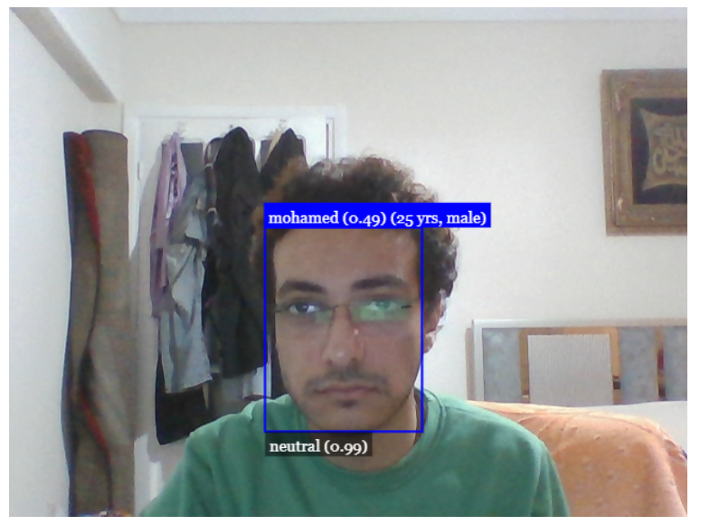

# 🎭 Face Recognition Web App

A real-time AI Face Recognition application running entirely in the browser using JavaScript. It detects faces, recognizes registered users, identifies gender/age, and reads facial expressions.



## 🚀 Features

* **Real-time Detection:** Detects faces instantly using the webcam.
* **Face Recognition:** Identifies specific users (e.g., "Mohamed", "Yassin") based on reference photos.
* **Landmark Detection:** Maps 68 facial points (eyes, nose, mouth).
* **Demographics:** Estimates **Age** and **Gender**.
* **Emotion Analysis:** Detects expressions like Happy, Sad, Angry, Surprised, etc.
* **Format Support:** Automatically handles both `.jpg` and `.png` reference images.

## 🛠️ Tech Stack

* **Language:** JavaScript (Vanilla)
* **Library:** [face-api.js](https://github.com/justadudewhohacks/face-api.js) (TensorFlow.js)
* **Frontend:** HTML5, CSS3
* **Tools:** Visual Studio Code, Live Server

## 📂 Project Structure

```text
face-recognition-app/
│
├── index.html          # Main application structure
├── script.js           # Core logic (Loading models, webcam, detection loop)
├── style.css           # Styling to align canvas over video
├── face-api.min.js     # The AI library
│
├── models/             # Pre-trained ML models (weights)
│   ├── ssd_mobilenetv1...
│   ├── face_landmark_68...
│   ├── face_recognition...
│   ├── face_expression...
│   └── age_gender...
│
└── labels/             # Reference images for training
    ├── mohamed/
    │   ├── 1.jpg
    │   └── 2.png
    └── yassin/
        ├── 1.png
        └── 2.jpg

```

## 🤖 The Models Used

This project uses specific neural networks for different tasks:

1. **`ssdMobilenetv1`**: Finds *where* the face is in the image (Bounding Box).
2. **`faceLandmark68Net`**: Finds the shape of features (eyes, nose, mouth).
3. **`faceRecognitionNet`**: Converts the face into a unique data signature to compare identities.
4. **`faceExpressionNet`**: Detects current emotion (Happy, Sad, Neutral).
5. **`ageGenderNet`**: Estimates age and gender.

## 🏁 How to Run Locally

Because of browser security (CORS), you cannot just open `index.html`. You must use a local server.

1. **Clone the repository**
```bash
git clone [https://github.com/YOUR_USERNAME/YOUR_REPO_NAME.git](https://github.com/YOUR_USERNAME/YOUR_REPO_NAME.git)

```


2. **Add Reference Photos**
* Go to the `labels/` folder.
* Create folders with names of people you want to recognize (e.g., `labels/YourName`).
* Add 2-3 clear photos named `1.jpg`, `2.jpg`, etc. inside.


3. **Start the Server**
* Open the folder in **Visual Studio Code**.
* Install the **"Live Server"** extension.
* Right-click `index.html` and choose **"Open with Live Server"**.


4. **Grant Permissions**
* Allow the browser to access your webcam when prompted.


## 🐛 Troubleshooting

* **White Screen / Camera won't start?**
* Check the console (F12) for red errors.
* Ensure your model paths in `script.js` have the dot: `./models` (not `/models`).
* Make sure `script.js` and `face-api.min.js` are in the root folder.


* **"Face Not Found" in console?**
* Ensure your reference photos in `labels/` clearly show a face.


## 📜 License

This project is open source and available under the [MIT License](https://www.google.com/search?q=LICENSE).